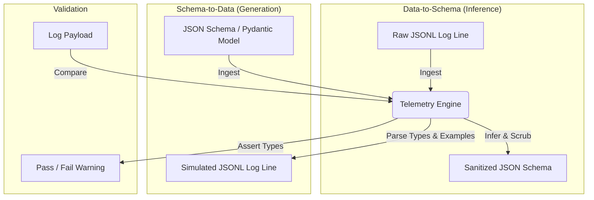

# ADR 0001: Architectural Blueprint and Telemetry Engine

## 1. Title
ADR 0001: Architectural Blueprint and Telemetry Engine

---

## 2. Status
**Proposed**

---

## 3. Context
We have separated the Elite Dangerous Journal/JSS SDK from the parent EDMarketConnector repository to manage its complexity independently. To prevent hand-coding 270+ discrete event classes, we need to design a **bi-directional, schema-driven Telemetry Engine** that handles validation, schema inference, and mock generation dynamically. We also need to guarantee strict decoupling of both the simulation adapter and the filesystem I/O operations from this core engine.

---

## 4. Decision

### 4.1 Core Telemetry Engine Design
We will implement a unified **`TelemetryEngine`** to serve as the core logic of the SDK. It will perform three base functions:
1. **Data-to-Schema (Inference):** Ingests raw JSON/JSONL strings from the game client and infers their JSON Schema.
2. **Schema-to-Data (Mock Generation):** Ingests a JSON Schema (or Pydantic model) and outputs a valid mock JSONL string populated with realistic values.
3. **Validation:** Checks raw data strings line-by-line against schemas to verify type and value constraints.

### 4.2 Decoupling the Simulation Layer
To maintain the Single Responsibility Principle and strict encapsulation:
* **One-Way Dependency:** The Core Domain and Telemetry Engine are completely isolated from the simulation system. They must never import or reference any class inside `testing/`.
* **Testing Adapter Boundary:** The Simulation classes (inside `src/ed_journal_sdk/testing/`) act strictly as driving adapters. They import and consume the Core Domain and Telemetry Engine to generate and format data, keeping dependencies entirely one-way.

### 4.3 Decoupling File I/O via Abstract Ports
To prevent the engine from locking to a specific filesystem, we define abstract ports for data input and output operations:

* **I/O Ports (Core Interfaces):**
  * `TelemetryWriter(Protocol)`: Defines the abstract interface for writing data strings (e.g. `def write_line(line: str)`).
  * `TelemetryReader(Protocol)`: Defines the abstract interface for reading file streams.
* **File I/O Adapter (`FileJournalIO`):**
  * Implements these core ports inside `src/ed_journal_sdk/testing/io.py`.
  * **Cross-Platform Compatibility:** Uses Python's standard `pathlib.Path` to handle OS-specific path separators automatically, ensuring compatibility for both Windows and Linux developers.
  * **Binary Safe Operations:** Employs unbuffered binary writing/reading (`'wb', 0`) to mirror the actual game client's operations and prevent cross-platform encoding/newline corruption.

### 4.4 Bi-Directional Flow
The engine operates as a bi-directional data translator:

### 4.5 Ports & Adapters Directory Layout
We will implement the package layout under `src/ed_journal_sdk/`:

* **Core Domain (`src/ed_journal_sdk/domain/`):**
  * Houses pure Pydantic models generated by the schema compiler and the abstract `TelemetryIO` ports.
* **Telemetry Adapter (`src/ed_journal_sdk/telemetry/`):**
  * `engine.py`: The `TelemetryEngine` class.
  * `parser.py`: Log tailer and observer using the engine.
* **Testing Simulator Adapter (`src/ed_journal_sdk/testing/`):**
  * `io.py`: Houses `FileJournalIO` (concrete filesystem adapter).
  * `writer.py`: Houses `MockJournalWriter` (interacts with the I/O adapter and engine).
  * `generator.py`: Mock value wrappers driving the engine.

### 4.6 Public API Specification (Contract)
We define the exact method signatures, types, and parameter names that constitute the SDK's public API contract:

#### 1. TelemetryEngine (Core Logic Interface)
* `def validate_line(self, jsonl_line: str, schema: dict = None) -> bool`:
  * Validates a single JSONL line string. Returns `True` if valid, raises `ValidationError` in strict mode, or logs a warning in lenient mode.
* `def generate_line(self, event_type: str, overrides: dict = None) -> str`:
  * Returns a valid, serialized JSONL string for the specified event type. Applies overrides dynamically.
* `def infer_schema(self, jsonl_line: str) -> dict`:
  * Generates a draft JSON Schema representing the structure of the provided JSONL log line.

#### 2. TelemetryWriter (Abstract Port Interface)
* `def write_raw_line(self, file_path: Path, line: str) -> None`:
  * Appends a raw string line directly to the specified file path.
* `def overwrite_file(self, file_path: Path, content: str) -> None`:
  * Overwrites the file at the specified file path with the content string.

#### 3. MockJournalWriter (Simulation Facade Interface)
* `def start_game(self, cmdr_name: str) -> None`:
  * Starts the simulation. Triggers the creation of a new active journal log, writes `Fileheader`, `LoadGame`, and `Rank` start events, and opens target file streams.
* `def write_event(self, event_type: str, overrides: dict = None) -> None`:
  * Generates a formatted event string using `TelemetryEngine` and appends it to the active journal log via the `TelemetryWriter` adapter.
* `def trigger_market_visit(self, market_id: int, commodities_data: list) -> None`:
  * Simulates docking at a market. Appends a `Market` event to the active journal log and overwrites the JSS companion file `Market.json` using the `TelemetryWriter`.
* `def stop_game(self) -> None`:
  * Appends the `Shutdown` event to the journal log and cleans up open file handles.

---

## 5. Consequences

### Positive:
* **Platform Independence:** The core engine runs identical code on Windows and Linux, while `pathlib` safely manages filesystem differences.
* **Headless Testing:** Developers can mock out the `TelemetryWriter` interface to test the engine entirely in memory without writing any files to disk.

### Negative:
* Requires maintaining the abstract `TelemetryIO` port protocols.
