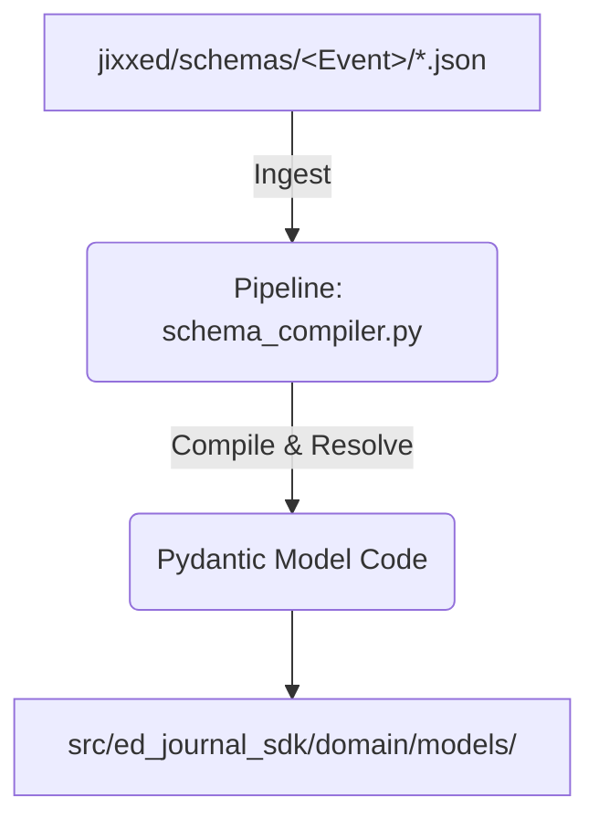

# ADR 0002: Schema Ingestion Pipeline and Version Control

## 1. Title
ADR 0002: Schema Ingestion Pipeline and Version Control

---

## 2. Status
**Proposed**

---

## 3. Context
Elite Dangerous has over 250 different journal events and companion snapshot formats. Hand-coding individual Python classes for every event is slow, error-prone, and unmaintainable. 

We need to establish a metadata-driven pipeline that:
1. Ingests raw JSON Schemas from the local community repositories we cloned (`jixxed/ed-journal-schemas`, `EDCD/EDDN`).
2. Synthesizes these schemas to "train" (or dynamically build) our Pydantic models and mock generators.
3. Implements strict version tracking so that developers and applications are immediately aware of which Journal manual version (currently v37) is supported.

---

## 4. Decision

### 4.1 Schema-Driven Ingestion Pipeline
We will implement an automated pipeline that consumes the JSON Schemas from the local directory structures:

1. **Schema Collation:** The pipeline script (`scripts/schema_compiler.py`) scans `/home/michael/src/github.com/jixxed/ed-journal-schemas/schemas/` to extract schema structures for each event.
2. **Inheritance Resolution:** The compiler merges `/schemas/_Event.json` (parent properties) with the target sub-schemas to compile fully resolved properties.
3. **Pydantic Model Generation:** The script translates the JSON Schema properties into strongly-typed Pydantic model source code files, writing them to `src/ed_journal_sdk/domain/models/`.
4. **Mock Example Ingestion:** The compiler extracts the `"examples"` arrays from the JSON Schemas and saves them to a static configuration dictionary inside `src/ed_journal_sdk/testing/generator_templates.py` to drive the `MockValueGenerator`.

### 4.2 Version Control & Developer Notifications
To enforce strict version tracking and ensure developers know which Journal version is actively supported:
1. **Package Gateway Metadata:** We will declare the supported journal manual version using the package-level string `__journal_version__ = "37"` inside the public package gateway `src/ed_journal_sdk/__init__.py`.
2. **Version Match Enforcement:** The validation engine (`src/ed_journal_sdk/telemetry/validation.py`) will read this version constant at startup. If a client attempts to validate a log file containing a `Fileheader` version that conflicts with the supported SDK version, the validator will raise a `VersionMismatchWarning` or `ValidationError` depending on the severity configuration.

---

## 5. Consequences

### Positive:
* **Zero Hand-Coding:** Automates the creation of 250+ Python model classes, ensuring complete schema parity with the game client.
* **Deterministic Mock Values:** The generator produces authentic values derived directly from official community examples.
* **Clear Versioning:** Programmatically enforces version compatibility, shielding downstream applications from silent schema changes.

### Negative:
* Developers must execute the `schema_compiler.py` script whenever they wish to update models to a new journal version (e.g. from v37 to a future v38).

---

## 6. Procedure & Implementation

1. **Write Compiler Script:** Create `scripts/schema_compiler.py` in the SDK repository.
2. **Declare Version Constant:** Append `__journal_version__ = "37"` to `src/ed_journal_sdk/__init__.py`.
3. **Compile Baseline Models:** Execute the script to generate the Pydantic models for `Fileheader`, `LoadGame`, and `FSDJump` under `src/ed_journal_sdk/domain/models/`.
